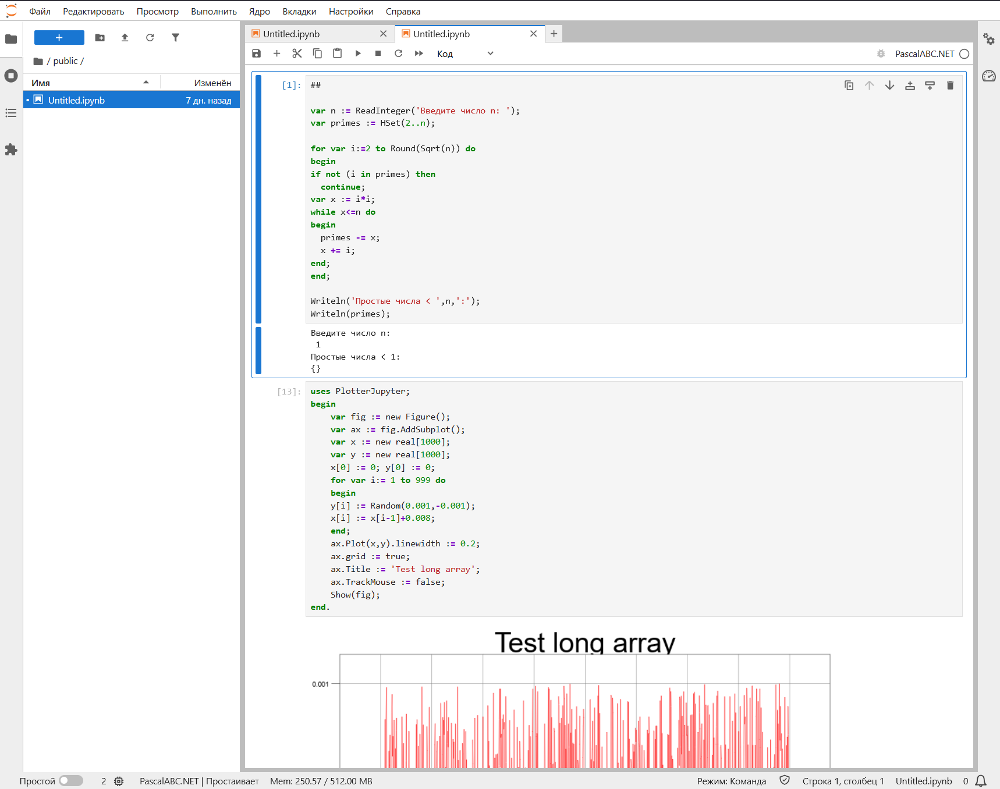

# Многопользовательская среда исполнения кода PascalABC.NET на сервере на основе JupyterHub

Данный репозиторий содержит конфигурационные файлы, скрипты и инструкции для развертывания многопользовательской серверной среды, предназначенной для выполнения и тестирования кода на языке **PascalABC.NET**.

## 🚀 Основные возможности

* **Централизованное исполнение PascalABC.NET:** Пользователям не нужно устанавливать среду разработки локально — вся работа и компиляция происходят на сервере через веб-интерфейс JupyterLab/Jupyter Notebook.
* **Изолированные среды:** Каждый пользователь получает собственную домашнюю директорию и независимый запущенный сервер, что исключает взаимное влияние или доступ к чужим файлам.
* **Кастомное ядро (Kernel):** Интеграция специализированного Jupyter-ядра для корректной поддержки синтаксиса, компиляции и вывода результатов работы программ PascalABC.NET.
* **Управление ресурсами:** Возможность жесткого ограничения выделяемой оперативной памяти (RAM) и процессорного времени (CPU) на каждый пользовательский сеанс для предотвращения перегрузки сервера некорректным кодом (например, зацикливанием).

